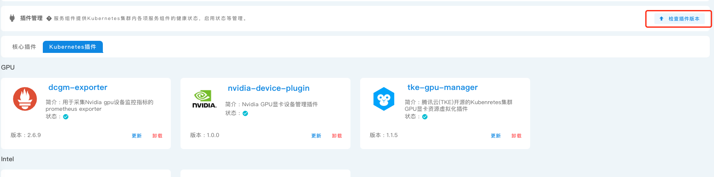
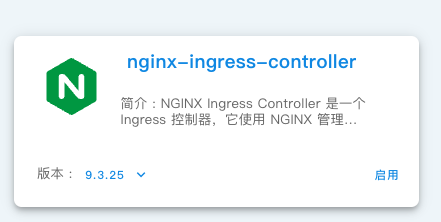

# 编写一个插件

一个插件本质上是一个 helm chart，kubegems 在其上做了功能的扩展和一些约定。
插件主要功能是对配置的重新规划和统一。

主要包含了：

- 支持统一配置镜像仓库，存储 以及集群名称等
- 使能插件之间配置联动(引用)

## 概念

| 名词         | 解释                                                                                                               |
| ------------ | ------------------------------------------------------------------------------------------------------------------ |
| plugin(资源) | plugin 一般指类型为 plugin 的资源(CR),由 kubegems-installer 提供。                                                 |
| 插件         | 仓库中 helm chart 格式存放的 chart.                                                                                |
| 插件管理     | kubegems web ui 中的插件控制部分功能，插件的启用/禁用本质上是创建/删除 `kubegems-installer` 空间下的 plugin 资源。 |

## 了解 Helm 基础

- Helm Cli: helm 命令行工具。
- Helm Chart: Helm 使用的包格式称为 chart。 chart 就是一个描述 Kubernetes 相关资源的文件集合。
- Chart 仓库: Chart 仓库 是一个配置了 index.yaml 文件和一些已经打包 chart 的 HTTP 服务器。

可以看一个标准的 Chart 是什么结构的

```sh
helm pull --repo https://charts.bitnami.com/bitnami --untar nginx-ingress-controller
```

```txt
nginx-ingress-controller/
  Chart.yaml          # 包含了chart信息的YAML文件
  LICENSE             # 可选: 包含chart许可证的纯文本文件
  README.md           # 可选: 可读的README文件
  values.yaml         # chart 默认的配置值
  values.schema.json  # 可选: 一个使用JSON结构的values.yaml文件
  crds/               # 自定义资源的定义
  templates/          # 模板目录， 当和values 结合时，可生成有效的Kubernetes manifest文件
  templates/deployment.yaml # 需要渲染的资源文件
  templates/NOTES.txt # 可选: 包含简要使用说明的纯文本文件
```

模板文件：

```tmplate
apiVersion: v1
kind: ReplicationController
metadata:
  name: deis-database
  namespace: deis
  labels:
    app.kubernetes.io/managed-by: deis
spec:
  replicas: 1
  selector:
    app.kubernetes.io/name: deis-database
  template:
    metadata:
      labels:
        app.kubernetes.io/name: deis-database
    spec:
      serviceAccount: deis-database
      containers:
        - name: deis-database
          image: {{ .Values.imageRegistry }}/postgres:{{ .Values.dockerTag }}
          imagePullPolicy: {{ .Values.pullPolicy }}
          ports:
            - containerPort: 5432
          env:
            - name: DATABASE_STORAGE
              value: {{ default "minio" .Values.storage }}
```

模板文件使用的 GO template 模板语法，加上了 helm 的扩展。
要完整学习 helm chart 可以看看 [Chart 模板开发者指南](https://helm.sh/zh/docs/chart_template_guide)

在 helm 模板语法中 `.Values` 对应 `values.yaml` 文件中的值，`.Chart` 对应 `Chart.yaml` 文件中的值。

helm 渲染：

```sh
# 默认渲染结果
helm template ./nginx-ingress-controller
# 尝试更改 values 中的值
helm template  nginx-ingress-controller ./nginx-ingress-controller --set global.imageRegistry="registry.cn-beijing.aliyuncs.com"
```

helm 部署：

```sh
# 部署本地 chart
helm install nginx-ingress-controller ./nginx-ingress-controller --dry-run
# 直接部署远程 chart
helm install --repo https://charts.bitnami.com/bitnami nginx-ingress-controller nginx-ingress-controller --set global.imageRegistry="registry.cn-beijing.aliyuncs.com" --dry-run
```

## 了解 Plugin 资源

先来了解一下 `plugin` 资源，插件控制的主要资源就是`plugin`资源，
plugin crd 由 [kubegems-installer](github.com/kubegems/kubegems/deploy/installer.yaml) 提供和处理的，
要使用 plugin 需要先安装 installer。

plugin 资源可以用来将一个 helm chart 部署到集群中。

例如，使用 plugin 来将 ingress controller 以 helm 方式 部署到集群中:

```sh
$ kubectl create namespace ingress-nginx
namespace/ingress-nginx created
$ cat <<EOF | kubectl apply -f -
# https://github.com/bitnami/charts/tree/master/bitnami/nginx-ingress-controller/#installing-the-chart
apiVersion: plugins.kubegems.io/v1beta1
kind: Plugin
metadata:
  name: nginx-ingress-controller
  namespace: ingress-nginx
spec:
  kind: helm
  url: https://charts.bitnami.com/bitnami
  chart: nginx-ingress-controller
  version: 9.3.25
  values:
    extraArgs:
      # https://kubernetes.github.io/ingress-nginx/user-guide/tls/#ssl-passthrough
      enable-ssl-passthrough: true
EOF
plugin.plugins.kubegems.io/nginx-ingress-controller created
$ kubectl -n ingress-nginx get plugins.plugins.kubegems.io #查看plugin状态
NAME                       KIND   STATUS      NAMESPACE       VERSION   APPVERSION   UPGRADETIMESTAMP   AGE
nginx-ingress-controller   helm   Installed   ingress-nginx   9.3.25    1.6.0        2s                 68s
```

plugin 还支持从 configmap/secret 填充 helm values 的功能：

```sh
kubectl -n ingress-nginx create configmap --from-literal=imageRegistry=registry.cn-beijing.aliyuncs.com global-values
```

```yaml
apiVersion: plugins.kubegems.io/v1beta1
kind: Plugin
metadata:
  name: nginx-ingress-controller
  namespace: ingress-nginx
spec:
  kind: helm # 插件类型，helm kustomize template，不知道就选择 helm
  url: https://charts.bitnami.com/bitnami # kind 为 helm 时，此值为 helm chart repo
  chart: nginx-ingress-controller # chart 名称，默认为 .metadata.name
  version: 9.3.25 # chart 版本
  values: # helm chart 渲染时需要替换的值
    extraArgs:
      # https://kubernetes.github.io/ingress-nginx/user-guide/tls/#ssl-passthrough
      enable-ssl-passthrough: true
  valuesFrom:
    - kind: ConfigMap
      name: global-values
      prefix: global.
```

其中的 `.spec.valuesFrom` 字段表示将名称为 `kubegems-global-values` 的 configmap 的 data 填充至 values 下的 并添加 `global.`前缀

查看合并和后的 values:

```sh
$ kubectl -n ingress-nginx get plugins.plugins.kubegems.io nginx-ingress-controller -ojsonpath='{.status.values}'  | yq -p json
extraArgs:
  enable-ssl-passthrough: true
global:
  imageRegistry: registry.cn-beijing.aliyuncs.com
```

可以看到 configmap 中的 key 都合并到了 kubegems 的 values 中。

此外: **修改 configmap 中的 data 值，也会触发所有引用该 configmap 的 plugin 进行更新**

这个特性可以用来帮助我们自动更新有引用关系的插件，
一个例子是 monitoring 插件需要知道 kubegems 告警的地址以进行告警推送，
kubegems 就提供了一个 configmap 供 monitoring 读取。

好，现在已经了解了 plugin 资源的基本功能了，就是帮我们快捷的部署 helm chart 到集群中，能够自动监听相关配置的变动，实时的更新 chart 的 value 。

## kubegems 插件系统

kubegems 的插件系统是基于 plugin 资源的，在这里`插件`实际上下面对应的就是 plugin 资源；
插件系统提供了一个友好的用户界面，还增加了 plugin(chart) 的版本更新，控制插件之间的相互作用，控制插件之间的版本依赖等。


**所有顶级 plugin 都是安装在 `kubegems-installer` 空间下的，也只有该空间下的 plugin 资源会展示在 web 界面的 “插件管理” 中。**

插件安装的动作，就是在集群上为插件生成其对应的 plugin 资源。

这些顶级插件，也会增加一些特别的注解：

- 插件系统依赖 chart repo 作为插件源，会将 repo 中所有有 annotation `plugins.kubegems.io/is-plugin: "true"` 的 chart 识别为插件。插件源通过 secret 配置。
- annotation `plugins.kubegems.io/values-from: logging` 表示该插件会从 logging 插件读取部分配置
- annotaion `plugins.kubegems.io/install-namespace` 会制定插件中的内容会被安装在哪个空间。

### 特别的 global 插件

上面说的了 valuesFrom 功能。

插件系统中有一个默认使用的 [global plugin](https://github.com/kubegems/plugins/blob/main/plugins/global)，
用于维护全局配置。

该 plugin 会生成上述的名称为 `kubegems-global-values` 的 configmap，
通过 WEB UI 插件管理启用的插件会默认增加对这个 configmap 的引用。

```yaml
apiVersion: plugins.kubegems.io/v1beta1
kind: Plugin
metadata:
  name: global
  namespace: kubegems-installer
spec:
  chart: global
  kind: template
  url: https://charts.kubegems.io/kubegems
  values:
    clusterName: manager-cluster
    imageRegistry: registry.cn-beijing.aliyuncs.com
    imageRepository: kubegems
    kubegemsVersion: v1.23.0
    storageClass: standard
  version: 1.0.0
```

## 编写插件

为了统一插件的行为(例如统一镜像仓库)，保留更多的灵活性，一般我们在制作在插件系统中展示的插件时，会在原始 plugin 上进行套壳。
使用一个父级插件，来将目标插件渲染出来并部署。

以对 `nginx-ingress-controller` 编写一个 kubegems 风格的插件为例:

### 定义新插件

要能够部署上述 `nginx-ingress-controller` 的 plugin，就需要一个插件来生成上述的 plugin,那么上述的 plugin 就被作为被 template 的资源。
就是用 plugin 来创建我们想要的 plugin。

> 插件没有模板，新增插件时可以参考 [plugins/cert-manager](plugins/cert-manager) 来编写。

所有的 plugin 都在放在 plugins 下以插件名称单独建立文件夹:

```sh
mkdir plugins/nginx-ingress-controller
```

在插件目录下新增一个 `Chart.yaml` 文件，用于描述插件的基本信息，插件用到的特别的 annotations 可以从 [这里](README.md) 查看。

```yaml
# plugins/nginx-ingress-controller/Chart.yaml
apiVersion: v2
name: nginx-ingress-controller
version: 9.3.25 # 建议保持与上游一致
appVersion: 9.3.25
description: NGINX Ingress Controller 是一个 Ingress 控制器，它使用 NGINX 管理 Kubernetes 集群中对 HTTP 服务的外部访问。
dependencies:
  - name: common
    repository: file://../common
    version: 1.x.x
annotations:
  plugins.kubegems.io/is-plugin: "true" # 表示这是一个 kubegems 插件，必要。
  plugins.kubegems.io/install-namespace: ingress-nginx # 插件需要被安装的namespace，即templates中的资源应当被安装的位置。如果为空则为 `kubegems-installer`
  plugins.kubegems.io/category: kubernetes/网络 # 插件分类，用于web ui 分类展示
```

增加 `values.yaml` 文件，将常用选项提出到 values 中，以便于 web ui 渲染。

为了 web ui 能够正常渲染还需要使用 [kubegems/tools/helm-schema](https://github.com/kubegems/kubegems/blob/main/tools/helm-schema)来生成 schema，
需要在 values 中增加一些注释。

```yaml
# plugins/nginx-ingress-controller/values.yaml
# global 字段下的值会从 global 插件注入,为了正常渲染,这里先占位
global:
  imageRegistry: ""
  imageRepository: ""
extraArgs:
  enable-ssl-passthrough: true
metrics:
  enabled: false
```

> 更多可用注释，需要查看 [helm-schema example](https://github.com/kubegems/kubegems/blob/main/tools/helm-schema/test/values.yaml)

根据 `values.yaml` 中的值为上面的的 nginx-ingress-controller plugin 创建模板文件,将里面的变量用 helm 模板语法替换:

```template
# plugins/nginx-ingress-controller/templates/nginx-ingress-controller.yaml
apiVersion: plugins.kubegems.io/v1beta1
kind: Plugin
metadata:
  name: nginx-ingress-controller
  namespace: {{ .Release.Namespace }}
spec:
  kind: helm
  url: https://charts.bitnami.com/bitnami
  chart: nginx-ingress-controller
  version: {{ .Chart.AppVersion }}
  values:
    extraArgs: {{ .Values.extraArgs  | toYaml | indent 6 }}
```

> common.images.repository 在 [plugins/common](plugins/common/templates/_helpers.tpl) 下,更多使用示例可以参照已有使用。

### 镜像本地化

如果需要支持统一配置镜像仓库，需要完成镜像的本地化配置。global 中有两个参数，`global.imageRegistry` 以及 `global.imageRepository` 用于配置镜像本地化。

例如，如果配置了 `global.imageRepository`为`registry.cn-beijing.aliyuncs.com`, `global.imageRepository`为`kubegems`。

如果使用到的镜像是 `docker.io/library/nginx:latest`应当被渲染为为`registry.cn-beijing.aliyuncs.com/kubegems/nginx:latest`.

查看一下原始 chart 生成使用到的镜像，要把这些镜像替换成对应的格式。

```sh
$ helm template  --repo https://charts.bitnami.com/bitnami nginx-ingress-controller | grep 'image: '
          image: docker.io/bitnami/nginx-ingress-controller:1.6.0-debian-11-r11
          image: docker.io/bitnami/nginx:1.22.1-debian-11-r26
$ #参考 https://artifacthub.io/packages/helm/bitnami/nginx-ingress-controller 进行values更改以满足需求
$ helm template  --repo https://charts.bitnami.com/bitnami nginx-ingress-controller \
    --set 'defaultBackend.image.registry=registry.cn-beijing.aliyuncs.com' \
    --set 'defaultBackend.image.repository=kubegems' \
    --set 'image.repository=kubegems/nginx-ingress-controller' \
    --set 'global.imageRegistry=registry.cn-beijing.aliyuncs.com' |  grep 'image: '
          image: registry.cn-beijing.aliyuncs.com/kubegems/nginx-ingress-controller:1.6.0-debian-11-r11
          image: registry.cn-beijing.aliyuncs.com/kubegems:1.22.1-debian-11-r26
```

由于镜像本地化需要将镜像 copy 到 kubgems 镜像仓库中，可以执行：

```sh
skopeo copy -a docker://docker.io/bitnami/nginx-ingress-controller:1.6.0-debian-11-r11 docker://registry.cn-beijing.aliyuncs.com/kubegems/nginx-ingress-controller:1.6.0-debian-11-r11
skopeo copy -a docker://docker.io/bitnami/nginx:1.22.1-debian-11-r26 docker://registry.cn-beijing.aliyuncs.com/kubegems/nginx:1.22.1-debian-11-r26
```

在 plugin 资源中，如果要达到上述命令行的功能则需要更改 `nginx-ingress-controller` plugin values 为：

```yaml
apiVersion: plugins.kubegems.io/v1beta1
kind: Plugin
metadata:
  name: nginx-ingress-controller
  namespace: ingress-nginx
spec:
  kind: helm
  url: https://charts.bitnami.com/bitnami
  chart: nginx-ingress-controller
  version: 9.3.25
  values:
    defaultBackend:
      image:
        registry: registry.cn-beijing.aliyuncs.com
        repository: kubegems
    global:
      imageRegistry: registry.cn-beijing.aliyuncs.com
    image:
      repository: kubegems/nginx-ingress-controller
```

对应的模板就需要更改为:

```diff
# plugins/nginx-ingress-controller/templates/nginx-ingress-controller.yaml
apiVersion: plugins.kubegems.io/v1beta1
kind: Plugin
metadata:
  name: nginx-ingress-controller
  namespace: {{ .Release.Namespace }}
spec:
...
  values:
    extraArgs: {{ .Values.extraArgs  | toYaml | indent 6 }}
+    defaultBackend:
+      image:
+        registry: {{ .Values.global.imageRegistry }}
+        repository: {{ .Values.global.imageRepository }}
+    global:
+      imageRegistry: {{ .Values.global.imageRegistry }}
+    image:
+      # repository: bitnami/nginx-ingress-controller
+      {{ include "common.images.repository" ( dict "repository" "bitnami/nginx-ingress-controller" "context" .) }}
```

> 可以查看 [plugins/common](plugins/common/templates/_helpers.tpl) 了解 `common.images.repository` 的具体实现。

### 生成用户可配置项

为了 web ui 能够正常渲染出配置页面还需要使用 [kubegems/tools/helm-schema](https://github.com/kubegems/kubegems/blob/main/tools/helm-schema)来生成 schema，需要在 values 中增加一些注释。

```yaml
# plugins/nginx-ingress-controller/values.yaml
# global 字段下的值会从 global 插件注入,不用在插件配置界面渲染，所以不加注解。
global:
  imageRegistry: ""
  imageRepository: ""
# @title 额外参数
# @title.en Extra Args
# @title.jp 额外変数
# @schema additionalProperties=true
extraArgs: {}
# @title 指标采集
# @title.en Metrics
# @title.jp 指標
metrics:
  # @title 启用
  # @title.en Enable
  enabled: false
```

插件编写完成后需要执行 helm-schema 生成，会生成附带国际化的 schema:

```sh
$ helm-schema plugins/nginx-ingress-controller
Reading plugins/nginx-ingress-controller/values.yaml
Writing plugins/nginx-ingress-controller/i18n/values.schema.en.json
Writing plugins/nginx-ingress-controller/i18n/values.schema.jp.json
Writing plugins/nginx-ingress-controller/values.schema.json
```

要测试生成的 schema 是否满足预期，可以访问 kubegems UI "/jsonschema/validate"路径下的测试工具检测 schema 渲染结果。

### 插件间配置共享

如果一个插件依赖于另一个插件的值来动态配置自己，那么就需要被依赖的插件提供出自己的配置（就像 global 插件那样）。
引出的配置存放在一个 configmap 中，以便于依赖插件使用。

例如 nginx ingress 如果用户配置了非默认的 ingress class 名称，若使用者要动态获取到这个名称，则可以使用这种方式。

增加共享 configmap 的生成：

```diff
# plugins/nginx-ingress-controller/templates/nginx-ingress-controller.yaml
apiVersion: plugins.kubegems.io/v1beta1
kind: Plugin
metadata:
  name: nginx-ingress-controller
  namespace: {{ .Release.Namespace }}
spec:
...
  values:
...
+    ingressClassResource:
+      name: {{ .Values.ingressClassName }}
```

```template
# plugins/nginx-ingress-controller/configmap-values.yaml
{{ include "common.component.configmap" . }}
data:
  ingressClassName: {{ .Values.ingressClassName }}
```

> 共享的 configmap 始终生成在 `kubegems-installer` 空间下，因为 `plugin` 中的 `.spec.valuesFrom` 始终读取相同空间下的对象。

对于要使用该插件的插件，只需要在 Chart.yaml 中增加注解 `plugins.kubegems.io/values-from: nginx-ingress-controller` 即可(引用多个时使用 ',' 分割)。

## 测试插件

### 本地测试

插件编写完成后，可以先进行本地 helm template 来检查生成的资源是否符合预期：

```sh
$ helm dependency update plugins/nginx-ingress-controller
$ helm template plugins/nginx-ingress-controller --namespace=ingress-nginx  --set global.imageRegistry=registry.cn-beijing.aliyuncs.com --set global.imageRepository=kubegems
---
# Source: nginx-ingress-controller/templates/nginx-ingress-controller.yaml
apiVersion: plugins.kubegems.io/v1beta1
kind: Plugin
metadata:
  name: nginx-ingress-controller
  namespace: ingress-nginx
spec:
  kind: helm
  url: https://charts.bitnami.com/bitnami
  chart: nginx-ingress-controller
  version: 9.3.25
  values:
    defaultBackend:
      image:
        registry: registry.cn-beijing.aliyuncs.com
        repository: kubegems
    global:
      imageRegistry: registry.cn-beijing.aliyuncs.com
    image:
      # repository: bitnami/nginx-ingress-controller
      repository: kubegems/nginx-ingress-controller
```

可以看到能够正常渲染出我们需要的位于 ingress-nginx 空间下的 plugin 。

### 集成测试

为保证插件能够正常的从 kubegems 插件系统上展示和安装部署，需要在本地搭建插件源，并将源添加至 kubegems installer，然后才能进行测试。

搭建本地源：

```sh
$ mkdir tmp && cd tmp
$ helm package -u ../plugins/nginx-ingress-controller
$ helm repo index .
$ python -m 'http.server'
Serving HTTP on 0.0.0.0 port 8000 (http://0.0.0.0:8000/) ..
```

添加本地源到 kubegems 插件系统：

> 目前插件源使用 secret 存储，后续可能会变更

```sh
kubectl -n kubegems-installer create secret generic --from-literal=address=http://<YOUR IP>:8000 plugin-repository-local
kubectl -n kubegems-installer label secrets plugin-repository-local plugins.kubegems.io/is-plugin-repo="true"
```

然后到 WEB UI 上 "插件管理" -> "检查插件版本" 以刷新源信息。



刷新后，即可在对应的分类下看到插件了



选择 “启用” 即可看到使用 schema 渲染出的 form,确认启用后会在 `kubegems-installer` 空间创建如下 plugin:

```sh
$ kubectl -n kubegems-installer get plugins.plugins.kubegems.io nginx-ingress-controller -oyaml
apiVersion: plugins.kubegems.io/v1beta1
kind: Plugin
metadata:
  annotations:
    plugins.kubegems.io/category: kubernetes/网络
    plugins.kubegems.io/description: NGINX Ingress Controller 是一个 Ingress 控制器，它使用
      NGINX 管理 Kubernetes 集群中对 HTTP 服务的外部访问。
    plugins.kubegems.io/health-check: ""
    plugins.kubegems.io/required: "false"
  finalizers:
  - plugins.kubegems.io/finalizer
  name: nginx-ingress-controller
  namespace: kubegems-installer
spec:
  chart: nginx-ingress-controller
  installNamespace: ingress-nginx
  kind: template
  url: http://<YOUR IP>:8000
  values: {}
  valuesFrom:
  - kind: ConfigMap
    name: kubegems-global-values
    optional: true
    prefix: global.
  version: 9.3.25
```

查看 `ingress-nginx` 空间下也创建了名称为 `nginx-ingress-controller` 的 plugin:

```sh
$ kubectl -n ingress-nginx get plugins.plugins.kubegems.io nginx-ingress-controller -oyaml
apiVersion: plugins.kubegems.io/v1beta1
kind: Plugin
metadata:
...
  finalizers:
  - plugins.kubegems.io/finalizer
  generation: 2
  name: nginx-ingress-controller
  namespace: ingress-nginx
...
spec:
  chart: nginx-ingress-controller
  kind: helm
  url: https://charts.bitnami.com/bitnami
  values:
    defaultBackend:
      image:
        registry: registry.cn-beijing.aliyuncs.com
        repository: kubegems
    global:
      imageRegistry: registry.cn-beijing.aliyuncs.com
    image:
      repository: kubegems/nginx-ingress-controller
  version: 9.3.25
status:
  ...
```

需要特别注意的是：

- 由于 webui 展示时是从 kubegems-agent 请求并且会缓存该 chart，如果在更新 chart 后需要再次查看效果的，**可以将版本号增加，或者从 agent 中删除缓存的 chart**。
- 部署时，是由 kubegems-installer 执行的安装，也会请求并缓存该 chart，如果在更新 chart 后需要再次查看效果的，**可以将版本号增加，或者从 installer 中删除缓存的 chart**

## 发布插件

在所有的工作准备完成后，就可以准备发布插件了。为保证插件正确，可以先执行一次：

```sh
make generate package check
```

发布插件只需要将插件的 chart 文件放在对应的目录，然后按照 kubgems 贡献流程提出 PR 即可。

```

```
